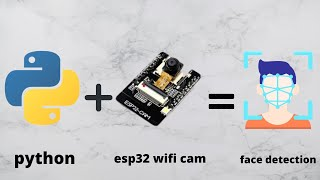

# Reconocimiento-facial-esp32cam | Python - OpenCV

1. Creando la base de datos de los rostros (CapturarRostro.py)
2. Entrenamiento del reconocerdor (entrenadorRF.py)
3. Reconocimiento en tiempo Real (Reconocimiento facial.py)

